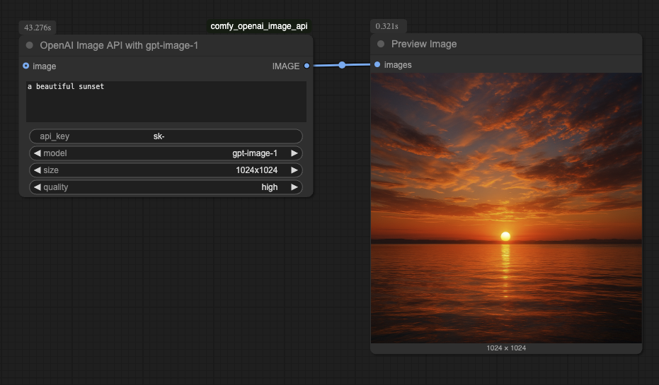

# OpenAI Image API

This custom node uses the OpenAI Image API (`gpt-image-1` model) to generate images or edit existing images using text prompts. When an input image and mask are provided, it performs inpainting.

It requires your OpenAI API key to be set as an environment variable `OPENAI_API_KEY` in your ComfyUI environment. This method avoids exposing the key directly in the workflow and is suitable for server environments.

> [!IMPORTANT]
> Using OpenAI's image generation models often requires your OpenAI organization account to be verified and may require specific usage tiers to be active. If your account does not meet these requirements, this node may fail to generate images.
> Please note that changes to account verification or usage tiers can take approximately 15 minutes to propagate through OpenAI's systems.

## Features

- Generate images from text prompts.
- Edit existing images based on text prompts.
- Perform inpainting on images using masks (white areas in the mask indicate regions to be replaced).

## Installation

1.  Ensure you have [ComfyUI](https://docs.comfy.org/get_started) installed.
2.  Install [ComfyUI-Manager](https://github.com/ltdrdata/ComfyUI-Manager).
3.  Manually clone this repository into your `ComfyUI/custom_nodes/` directory.
4.  Restart ComfyUI.

## Configuration

Before using the node, you **must** set the `OPENAI_API_KEY` environment variable in the system running ComfyUI. For example:

```bash
export OPENAI_API_KEY="your_openai_api_key_here"
```

Restart ComfyUI after setting the variable if it was already running.

## Example Usage (Prompt Only)



*Providing an `image` input enables editing mode. Providing both `image` and `mask` inputs enables inpainting mode.*

